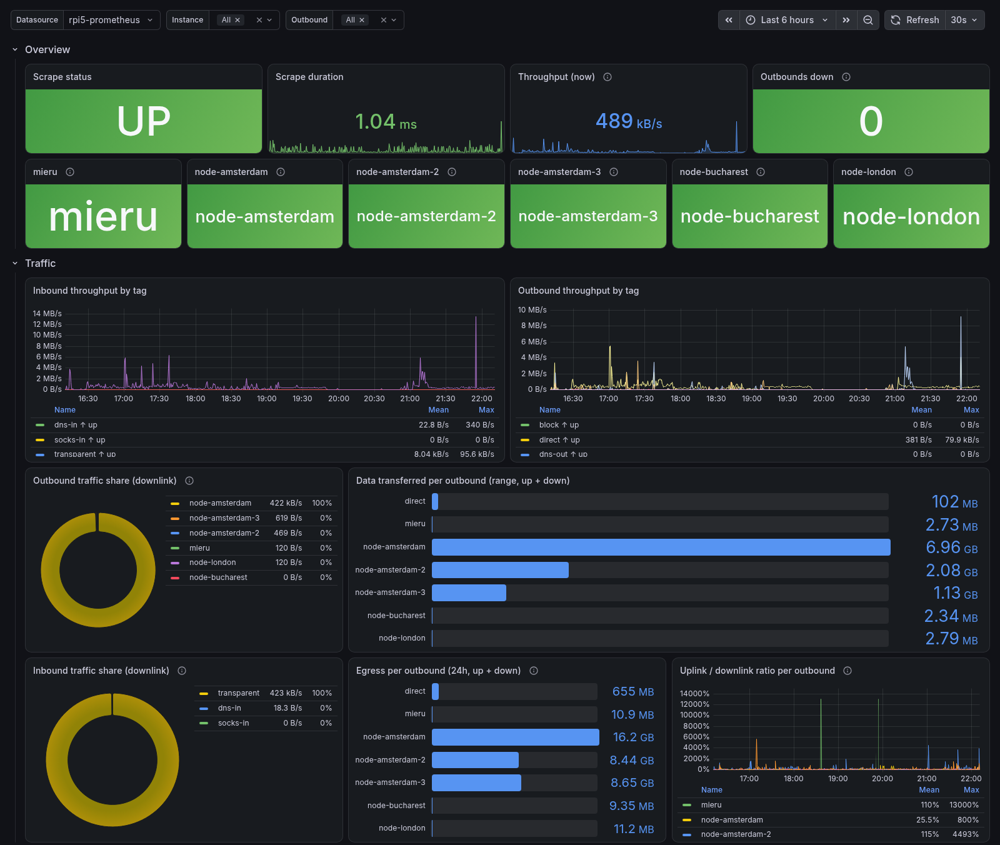
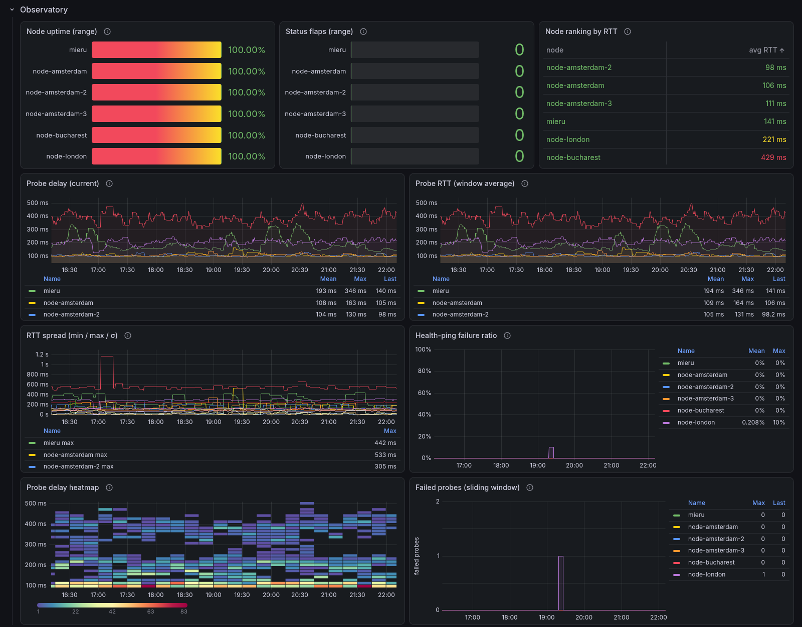

# xray-exporter

[](https://github.com/grum261/xray-exporter/actions/workflows/ci.yml)
[](https://github.com/grum261/xray-exporter/releases/latest)
[](https://pkg.go.dev/github.com/grum261/xray-exporter)
[](LICENSE)

A Prometheus exporter for [Xray-core](https://github.com/XTLS/Xray-core).

The exporter reads Xray's built-in `/debug/vars` endpoint and serves the data
as Prometheus metrics. You get traffic per inbound, outbound and user,
observatory probe results, and Xray's Go runtime memory stats. It ships as a
single static binary with no runtime dependencies. A Grafana dashboard is
included.

```
Xray /debug/vars  ──HTTP──▶  xray-exporter :9356/metrics  ──HTTP──▶  Prometheus
```

## Why

Xray's `metrics` object serves expvar JSON, not the Prometheus text format.
The generic [json_exporter](https://github.com/prometheus-community/json_exporter)
can't turn JSON object keys into labels ([issue #96][json-96]). With it, every
inbound and outbound tag has to be hardcoded. This exporter handles any set of
tags without that.

[json-96]: https://github.com/prometheus-community/json_exporter/issues/96

## Features

- Uplink and downlink byte counters per inbound tag, outbound tag and user.
- Results from both observatory types, [`observatory` and `burstObservatory`](docs/xray-setup.md#observatory-optional):
  whether each outbound is alive, its probe latency and its RTT statistics.
- Xray's Go runtime memory stats (`xray_memstats_*`).
- A health signal for each scrape: `xray_scrape_success` and `xray_scrape_duration_seconds`.
- No stale values. Each Prometheus scrape fetches `/debug/vars` once, and
  nothing is cached between scrapes. When Xray is down, only the scrape
  health metrics are emitted.
- Each collector can be turned on or off with a flag or an environment variable.
- [Grafana dashboard](deploy/xray-grafana-dashboard.json) and a hardened
  [systemd unit](deploy/xray-exporter.service) are included.

## Grafana dashboard

The [included dashboard](deploy/xray-grafana-dashboard.json) opens with scrape
health, the status of each observatory outbound and throughput per inbound and
outbound tag.



The Observatory row shows uptime, status flaps, probe latency and failed probes
for each outbound.



Further rows cover the exporter's own health and Xray's runtime memory stats.
See [docs/deployment.md](docs/deployment.md) for how to import it.

## Quick start

**1. Enable metrics in Xray.** Add these top-level keys to your Xray config
and restart Xray:

```json
{
  "metrics": { "tag": "metrics", "listen": "127.0.0.1:11111" },
  "stats": {},
  "policy": {
    "system": {
      "statsInboundUplink": true,
      "statsInboundDownlink": true,
      "statsOutboundUplink": true,
      "statsOutboundDownlink": true
    }
  }
}
```

Per-user counters, observatory setup and older Xray versions are covered in
[docs/xray-setup.md](docs/xray-setup.md).

**2. Install the exporter.** Pick one of these:

```bash
# Prebuilt binary (linux, darwin and freebsd; amd64, arm64 and armv6/v7):
# download an archive from https://github.com/grum261/xray-exporter/releases/latest
tar -xzf xray-exporter-*.tar.gz

# With the Go toolchain (Go 1.26+):
go install github.com/grum261/xray-exporter/cmd/xray-exporter@latest

# Container image (linux/amd64, arm64 and arm/v7):
docker pull ghcr.io/grum261/xray-exporter:latest
```

**3. Run it:**

```bash
xray-exporter --xray.endpoint=http://127.0.0.1:11111/debug/vars

# Or in Docker. The host network lets the container reach Xray on 127.0.0.1:
docker run -d --name xray-exporter --network host ghcr.io/grum261/xray-exporter:latest \
  --xray.endpoint=http://127.0.0.1:11111/debug/vars

curl -s http://127.0.0.1:9356/metrics | grep '^xray_'
```

**4. Scrape it** from Prometheus:

```yaml
scrape_configs:
  - job_name: xray
    static_configs:
      - targets: ["127.0.0.1:9356"]
```

To run the exporter as a systemd service or with Docker Compose and import the Grafana dashboard, see
[docs/deployment.md](docs/deployment.md).

## Configuration

Every flag can also be set with an environment variable. The flag wins if both
are set.

| Flag | Env | Default |
|------|-----|---------|
| `--web.listen-address` | `LISTEN_ADDR` | `:9356` |
| `--web.telemetry-path` | `TELEMETRY_PATH` | `/metrics` |
| `--xray.endpoint` | `XRAY_ENDPOINT` | `http://127.0.0.1:11111/debug/vars` |
| `--xray.timeout` | `XRAY_TIMEOUT` | `5s` |
| `--log.level` | `LOG_LEVEL` | `info` |
| `--collector.{scrape,memory,traffic,observatory}` | `COLLECTOR_{SCRAPE,MEMORY,TRAFFIC,OBSERVATORY}` | `true` |
| `--version` | — | — |

[docs/configuration.md](docs/configuration.md) lists every option with the
values it accepts, and the HTTP endpoints.

## Metrics

| Group | Metrics |
|-------|---------|
| Scrape health | `xray_scrape_success`, `xray_scrape_duration_seconds` |
| Traffic | `xray_{inbound,outbound}_{uplink,downlink}_bytes_total{tag}`, `xray_user_{uplink,downlink}_bytes_total{user}` |
| Observatory | `xray_observatory_alive{tag}`, `xray_observatory_probe_delay_milliseconds{tag}`, … |
| Burst observatory | `xray_burst_observatory_{samples,failures}{tag}`, `xray_burst_observatory_rtt_{average,min,max,deviation}_seconds{tag}` |
| Xray runtime | `xray_memstats_*` |
| Exporter | `xray_exporter_build_info`, `go_*`, `process_*` |

[docs/metrics.md](docs/metrics.md) is the full reference. It also has example
PromQL queries.

## Documentation

- [Xray setup](docs/xray-setup.md): enabling metrics, stats and the observatory in Xray.
- [Configuration](docs/configuration.md): flags, environment variables and HTTP endpoints.
- [Metrics](docs/metrics.md): every metric the exporter emits, with example queries.
- [Deployment](docs/deployment.md): systemd, Prometheus, Grafana and troubleshooting.
- [Contributing](CONTRIBUTING.md): building, testing and the release process.

## License

[MIT](LICENSE)
